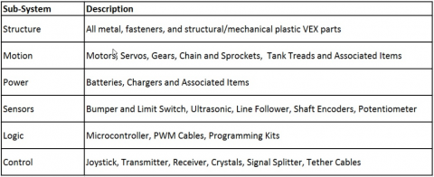
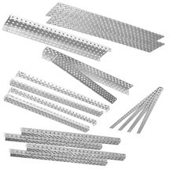
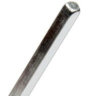
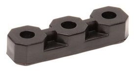
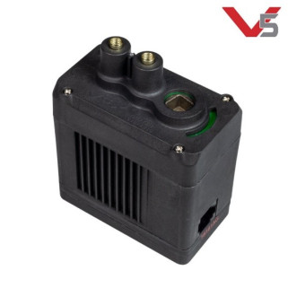
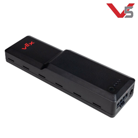
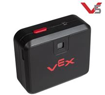
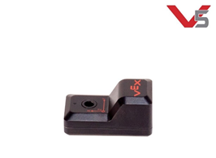

# Guide
Introduction To Robotics
## What is Robotics
Robotics is the field of science involving the production and application of robots. Robots are mechanical machines capable of carrying out both simple and complex actions, automatically or while being operated by a person. Robots are used in many applications such as factory production, heavy lifting, space exploration, and construction. In this unit, we will explore the basics of robotics and their application in this program
## Components of a Robot
A robot is made of 4 core parts: the body/frame, control system, manipulators, and the drivetrain. 

**The body**: 

The body or frame of the robot can be any shape or size, and it provides the structure of the robot, similar to a human skeleton. Often times when we hear the word “robot” we picture a metallic form similar to that of a human, but this is not always the case. A robot’s shape is determined by the task(s) it is meant to accomplish. 

**The Control System**: 

The control system is the “brain” of a robot and it controls the robot’s actions. This most often takes the form of a central processing unit, or CPU. A CPU is the chip found in modern day computers and cellphones that handles the processing of information at very fast speeds. For example, the CPU can interpret an input, such as a human pressing a button, and make the robot react accordingly. 

**The Manipulators**: 

In order for some robots to complete their designated tasks, they are required to interact with objects in their environment. In order to move and manipulate these objects, an interface such as a claw or similar appendage must be included in the robot. 

**The Drivetrain**: 

Some robots are able to accomplish their tasks while stationary, but others need to move around. For this they require a drivetrain. A drivetrain most often takes the form of humanoid legs or some sort of wheeled solution (like tires on cars). 

## Robotics in this Program 

In this program, we will focus on creating robots using the VEX Robotics platform. This platform allows for the creation of robots intended to compete in a game which changes every year. VEX Robotics is an extremely powerful platform, as the components provided for creating a robot vastly simplify the process of creating a robot. The VEX Robotics company provides all the necessary components such as motors, metal bars, a control system, and many others. The metal components allow for simple assembly of a Robot frame, as they are designed to connect together using nuts and bolts. 

**VEX Product Subsystems** 

**STRUCTURE**

The parts in the VEX Structure Subsystem form the body of a robot, to which all other components are attached. Metal bars (which all contain square holes (0.182” sq on a 0.5” grid) are fastened together using fasteners such as nuts and bolts. By fastening metal bars together, we can make simple and complex frames to accommodate other components. 

(structural pieces)

The majority of the components in the Structure Subsystem are made from bent aluminum or steel sheet metal. These pieces come in a variety of shapes and sizes and are suited to different applications on a robot.  

**MOTION**

The VEX Motion Subsystem comprises all the components which make a robot move. These components are tightly integrated into the components of the Structure subsystem when building a robot. The most fundamental concept of the Motion Subsystem is the use of a square shaft to transmit torque.  

(Shaft)

The square axles are combined with the structural components using a VEX Delrin bearing. 

(Bearing)

The square axles are fitted to and spun by VEX motors. 

(motor)

**POWER**  

The parts in the VEX Power Subsystem consist of the electrical components that provide power to the robot and the controller. The robot is powered by a rechargeable Lithium Iron Phosphate battery, pictured below.  

(A V5 Robot Battery)

**SENSORS**

The VEX Sensor Subsystem currently consists of 2 components: the vision sensor and the inertial sensor. These sensors give the robot the ability to detect various things in its environment. The sensors are the “eyes and ears” of the robot, and can even enable the robot to function independently of human control. A robot senses its environment and adjusts its own behaviors based on that knowledge.

(V5 Vision Sensor) (V5 Intertial Sensor)

**LOGIC**

The Logic subsystem is the “brains” of the robot, it consists of an electronic touch screen interfaced device with ports to manage the various functions of a robot. 

(V5 Robot Brain)