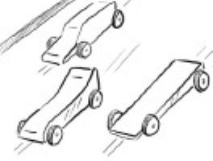
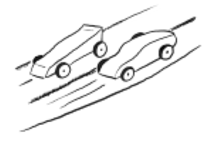
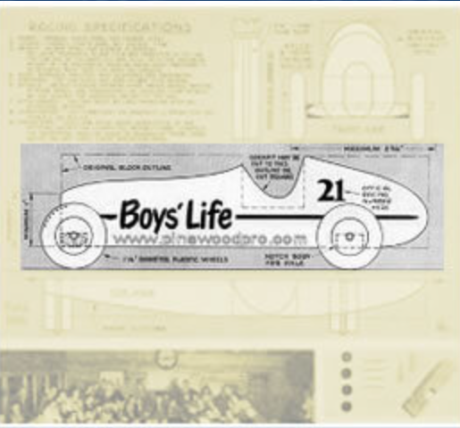
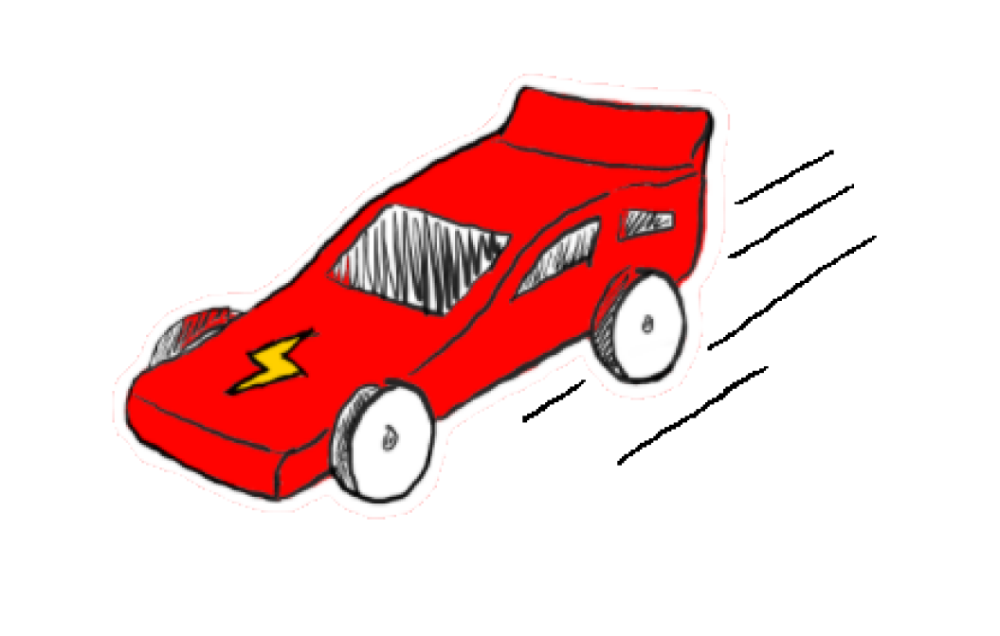
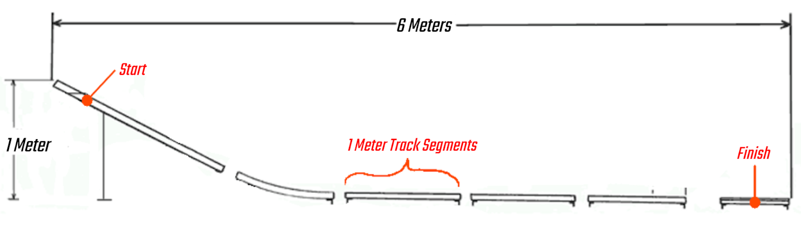
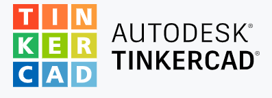

# Competition Outline

## What are Gravity Cars?
Gravity Cars are unpowered, unmanned cars that race on a downward sloping track. The cars only utilize gravity to move; however, many other concepts in physics must be considered to build a winning design!

               
Images retrieved from: Vanessa Quon (SRIL)
## Pinewood Derby - The history of gravity cars
Inspired by soap box derby races, Don Murphy came up with the idea for pinewood derbies in 1953. As the name suggests, the cars are traditionally built from a block of pine wood, wheels, and axles. Before racing, these components are modified by carving or adding weight in consideration of air drag, friction, rotational energy, and other forces. 
 below there is an image of the original Pinewood Derby car designed by Don Murphy in 1953. 

      

Image retrieved from: https://www.pinewoodpro.com/pinewood-derby-history.php

## Our 2021 Challenge
This year, SRIL will be conducting a design challenge for high school students across Surrey. Inspired by Pinewood Derby and Major Hardware’s “Fan Showdown”. SRIL will use the technology of CAD and 3D Printing to empower youth to design cars to their heart’s content, and race them in a time trial race down a 6m long by 1m high slope. Points will be awarded for speed and unique design.

   Image retrieved from: Vanessa Quon (SRIL)

## Car Specifications
In order to compete, a gravity car must meet the following rules:
1. Car dimensions are a maximum of 100mmx50mmx40mm (LWH)
2. Must be submitted as a .STL file by August 14th
3. Must have team name and number on the car
4. Must have two 2.2mm holes for axles

## Track Specifications
All cars will be raced live down a 6m long, 1m high ramp. Ramp shown below: (The track will not have gaps)

Image modified from: https://www.besttrack.com/track_specs.html

## CAD Softwares
While there are a lot of CAD softwares, we suggest using the simple online program known as Autodesk Tinkercad. However, those who have experience and access to more complex softwares are welcome to use their program of choice. 

Image retrieved from Tinkercad website: https://www.tinkercad.com/dashboard
You will need to sign up for an account to use this software.

**The race will take place via livestream on August 28th 2021! Good luck!**

For more information, check out the links below!

History of pinewood derby cars: https://www.pinewoodpro.com/pinewood-derby-history.php

SRIL Tinkercad tutorial: (Tbd)

