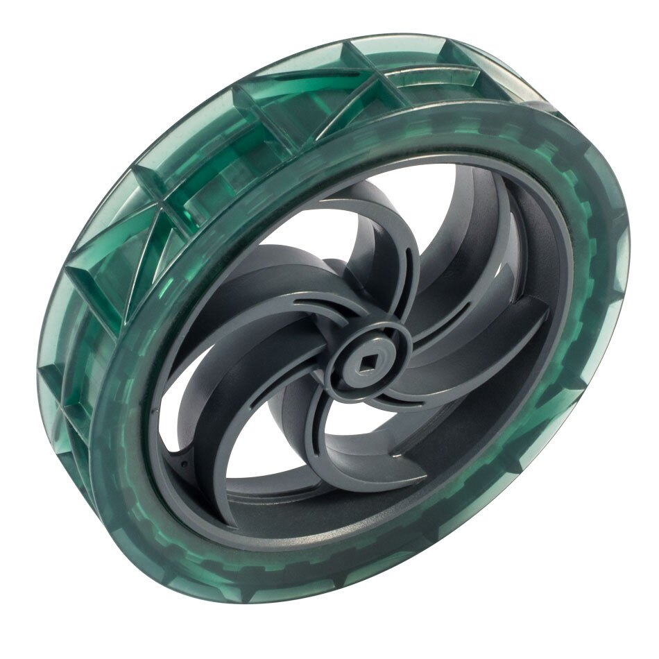
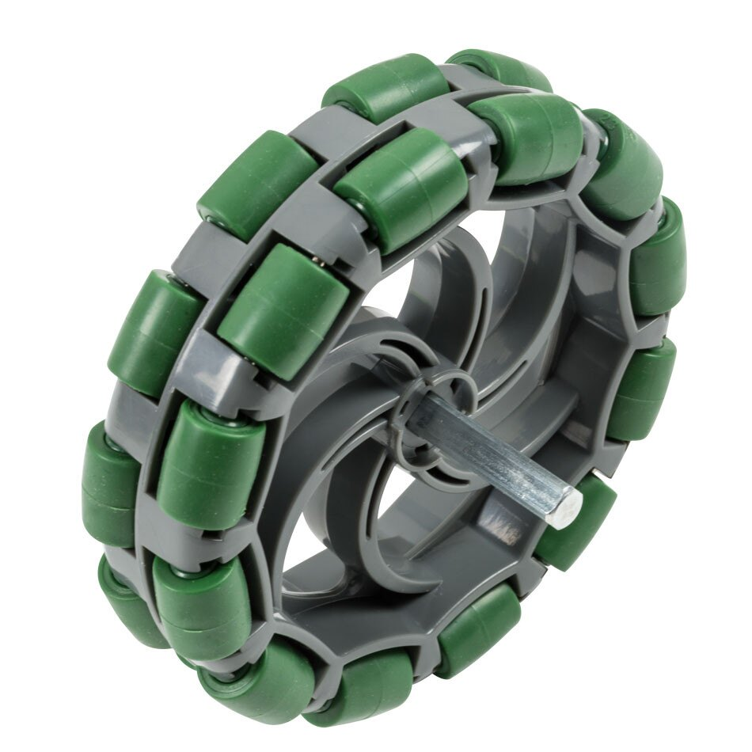
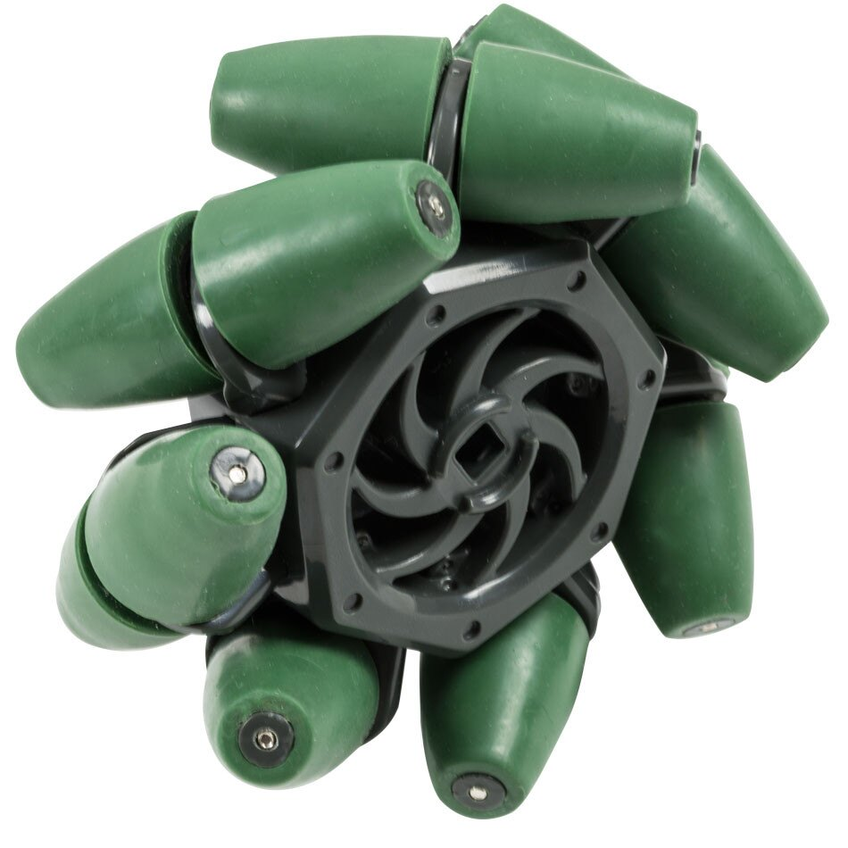
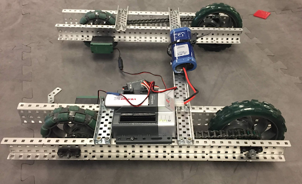
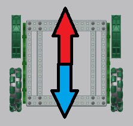
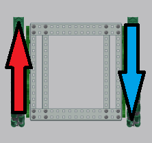
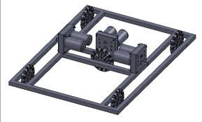
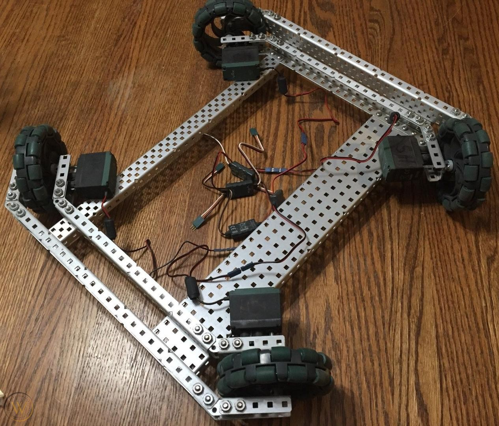

# Drivetrain Design
In short, the drivetrain is the subsystem of any moving (translation over some distance) mechanical entity. It contains the chassis, a method for motion, and the connecting elements. Automobiles, for example, may use several types of drivetrains (2WD, 4WD, AWD, etc.) in which the different configurations provide specific benefits. The same can be said for robots.

Many new robotics teams overlook the importance of serious deliberation regarding their robot’s drivetrain. In certain games, some drivetrains do not even allow for full play, in turn restricting the team’s ability to score the maximum points. Since the objective is to be as capable as possible in most games, choosing a drivetrain design that allows for the most capability is best. Hence, this unit will highlight the base, the chassis, the drivetrain, or whatever it may be called, for it is arguably the biggest factor in competition robotics success. 

## Wheels

**Traction Wheels**

Traction wheels are the standard wheels used, especially in smooth surfaces and for climbing. Numerous sizes and traction shapes (2.75” / 3.25” / 4” / 5” [most popular] / 6”, square/round) are available for different purposes. It is best used on the turning axis or where lateral movement isn’t occurring. 

**Omni Wheels**

Another popular option used are omni wheels which have omni directional motion capability with rollers. This means they can move laterally as well as forward-backward. These wheels allow for improved turning, however reduce stability and climbing ability.

**Mecanum Wheels**

Mecanum wheels can only be used effectively in certain H-drive style bases with 4 mecanum wheels. Although more difficult to use, all-directional motion is very simple with mecanum wheels. 

## Types of Drivetrains

There are several major drivetrain designs used in VEX and FIRST competition robotics. Depending on a team’s construction and programming ability, several may be unfeasible for newer teams, but are attainable with experience. 

The main drivetrain designs are:

1. Tank Drive
1. Slide Drive (or H-Drive)
1. Holonomic Drive
1. Mecanum Drive

 **Tank Drive**

A simple, beginner-friendly design, the “tank” drive, as it is affectionately named, allows for easy construction and programming. 

(A simple example of a tank drive (with chains for motor efficiency) Dwayne Lemos, 2019)

Tank drives are quite versatile, and can be used as a simple push-bot (a robot with the sole purpose of pushing objects around the play area), or can be built upon for a complex system. They can be built in as little as an hour (like the example shown above) with very few frills, yet provide a stable and dependable platform. This means they are generally the design of choice for newer teams. 

Opposing sides of a tank drive base have wheels or tank treads or a combination of both. Moving the opposite sides in the same direction moves the robot forward and back, while rotating them in opposite directions causes the robot to rotate. 

Logically, using certain wheels will provide certain turning characteristics – traction wheels will not allow for easy turning, as they are designed for single-axis movement. However, using omni wheels, with multi-direction motion, smooth turning can be achieved. This is the wheel of choice for most teams in most circumstances, although it leaves the robot open to unwanted lateral movement in competition. Additionally, variations include 6- and 8-wheel drive as well as wheels at different heights for climbing.

(Tank drives generally only have front-back mobility with 4 traction wheels)

(With omni wheels, turning ability can be improved)

Push-bots can be used, and are very effective, in select scenarios, such as VRC Starstruck (2016-2017) in which push-bots were widely used to transport game pieces to the opposing side. In this case, tank drives were ideal, as straight-line power was necessary to score as many points as possible. 

Characteristics of the tank drive are:

1. Uperior lateral stability (especially when using traction wheels)
1. Simple to build, program, operate and troubleshoot
1. Can be run easily with 2 motors
1. Provides large central area for building
1. Slower lateral motion (turn, move)

**Slide Drive / H-Drive**

A popular variation of the tank drive comes from adding an omni wheel to the lateral axis. This improves movement as the robot can now move laterally without being required to turn. However, this requires full use of omni-wheels, which introduce new challenges.

(An example of a slide/H-drive (note the placement of the perpendicular wheel)
Bison Robotics, 2017)

The additional mobility provided by this extra wheel is useful for strafing and can be used to quickly line up multiple targets. This gives it an advantage over tank drives in some games. 

Challenges include:

1. Additional weight and motor requirement
1. More difficult to build
1. Additional wheel can get caught on obstructions/cause challenges when climbing
1. Traction decreases due to omni wheels

**Holonomic Drive**

Essentially a partially rotated H-drive chassis, holonomic drives move a robot in a diagonal motion, allowing for easy lateral movement built into the design. However, it does not allow for motion on the ‘normal’ axes.

In addition, stability is reduced due to the omni wheels required for this drivetrain. 

Distribution of weight and balancing a robot with this drivetrain might prove more difficult due to the potential positioning of the wheels at the center of each edge. 

Programming is relatively simple for this drivetrain, however operation and construction is challenging for newer teams.

(Holonomic Drive example (note the positioning of the wheels))

**Mecanum Drive**

Another deviation of the H-Drive is the Mecanum drive (mech-an-um), in which the wheels attached are mecanum wheels. These wheels can travel in any direction without needing to rotate, depending on the power supplied to each wheel. 

With this advantage comes the difficulty of programming mecanum drivetrains, which requires significant testing and development. Driving mecanum drives is also more difficult due to the limited amount of buttons accessible on the controller.

## Factors to consider

The drivetrain has multiple purposes depending on the game being played. Although the primary purpose is to traverse around the play area, to build the ideal drivetrain, one must take into account several factors. These include (among others):

1. the ability to accommodate an appropriate manipulation mechanism (eg. a claw)
1. the ability to traverse the play area in a logical manner 
1. the ability to interact with other robots appropriately
1. capabilities of the driver and programmer (this is due to the fact that certain drivetrains are more difficult to program and operate)