# Introduction to Lifting Mechanisms
In this unit, we will explore the methodology behind lifting game pieces/robots. As you may have already seen, scoring points in a vex robotics competition can require game pieces to be lifted to a certain height, as shown below:
<iframe src='https://gfycat.com/ifr/HeartyVeneratedAbyssiniangroundhornbill' frameborder='0' scrolling='no' allowfullscreen width='640' height='412'></iframe>
There is a wide variety of different types of lift systems to choose from in order to lift objects and score points most efficiently. Some are easier to build then others, and not all lift systems are able to accomplish the same task.

## Degrees of Freedom

In order to understand how lift systems work, we first have to cover the degrees of freedom a system can have and how rotating joints work.

A degree of freedom refers to a systems ability to move in a single, independent motion. If a system can move in multiple directions, it has multiple degrees of freedom. A systems capability to accomplish tasks can be limited by how many degrees of freedom it may have.

#1

The first type of degree of freedom is one in which the robot’s arm can rotate about an axis parallel to the arm. It is similar to the degree of freedom found in a human wrist.

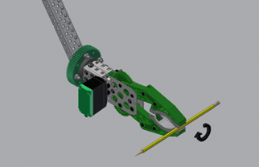 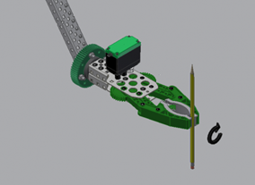

If you hold a pencil parallel to the ground in your fist and rotate it so that the pencil is perpendicular to the ground, this represents a rotational degree of freedom.

#2

The second type of degree of freedom is one which involves linear movement. In this case, a component on a robot can slide in and out (this can create a up and down motion, or a side to side motion). It is the same degree of a freedom a desk drawer has; it may only slide in or out.

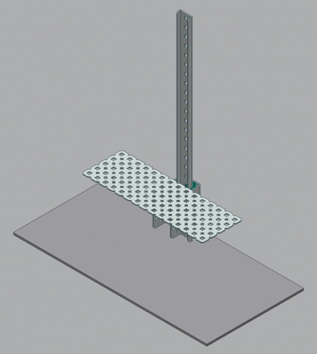 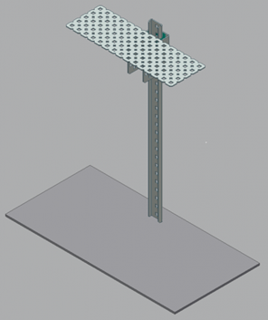

Below is a GIF that shows how a desk drawer slides in and out.

<iframe src='//gifs.com/embed/accuride-self-closing-8qL6G5' frameborder='0' scrolling='no' width='640px' height='360px' style='-webkit-backface-visibility: hidden;-webkit-transform: scale(1);' ></iframe>

#3

The third type of degree of freedom is one in which there is rotation about an axis perpendicular to an arm.  The human elbow is an example of a rotational joint with this degree of freedom.

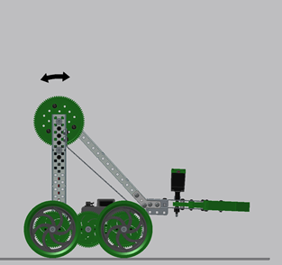 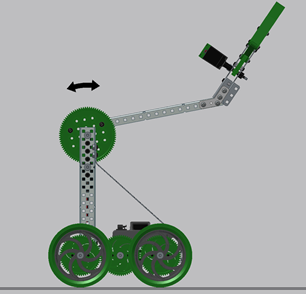

Extremely complex robots such as the ones depicted below can combine multiple degrees of freedom to perform complex tasks:

<iframe src='https://gfycat.com/ifr/ElegantUnknownAmazondolphin' frameborder='0' scrolling='no' allowfullscreen width='640' height='404'></iframe>

<iframe width="740" height="416" src="https://www.youtube.com/embed/HbxEerw6vk4" frameborder="0" allow="accelerometer; autoplay; clipboard-write; encrypted-media; gyroscope; picture-in-picture" allowfullscreen></iframe>

Rotating Joints

Rotating joints are used frequently in lift systems of different types, so it is important to learn to not stress these types of joints and avoid failures/breakages. As we learned in the mechanical power transmission unit, gearing can be used to reduce the load on a motor/joint. In the images above, you can see a simple rotating joint, where the entire load is borne on one motor. However, by using gear reduction we can reduce the load on said motor, as shown below.

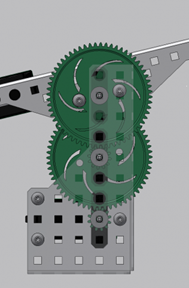

This joint has two stages of 12:60 gear reductions.  The second stage is attached directly attached to the robot arm.   The second stage also has two of the same gear reduction running in parallel; this means that the load is divided evenly over these two sets of gears.  By reducing the load on individual components, the joint is less likely to have a failure (broken gear, etc).

## Types of Lifts

**Bar Lift**

Bar lifts use rotational motion to rotate an arm usually made of c-channels to reach high places. This rotational motion allows objects attached to the lift to rotate at an arc, usually resulting in the attached mechanism reaching out as it gets higher.

The most common bar lifts in VEX use c-channels set parallel at the same length, such as the 4-bar lift shown below:

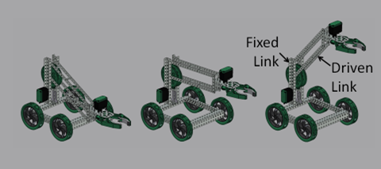 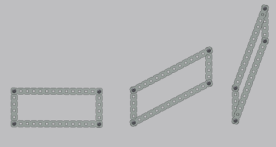

(As the lift articulates…the bars stay parallel to eat other)

Additional c-channels can be added to create a 6-bar lift (depicted below), or even an 8-bar lift!

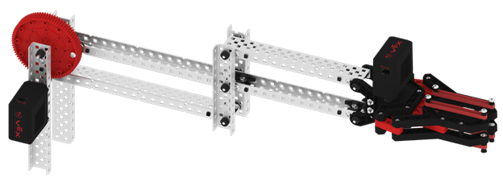

**Reverse Bar Lift**

Reverse bar lifts are a variation of the bar lift that uses a bar lift attached to another bar lift facing opposite of the first lift. This allows the robot to reach somewhat higher than a typical bar lift and lift objects attached to the lift in a near vertical motion. Despite being similar to a simple bar lift, reverse bar lifts are much more complicated to build. They can be “driven” from the bottom most joint, or the center joint.

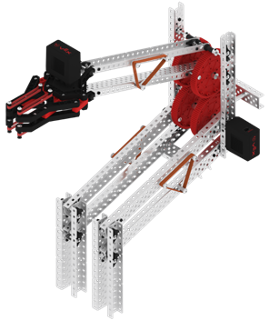

This is an excellent YouTube video for more information on building VEX bar lifts: https://youtu.be/hZUbCSGAy-o

**Linear Elevator**

A linear elevator utilizes the linear degree of movement to move up and down. There are 2 types of liner lifts, but they both accomplish the same thing.

Linear Slide elevators utilize the parts from a Vex linear motion kit. Rack gears, powered by a motor and pinion gear, are used to move a linear slide track up and down. The mechanism looks something like this:

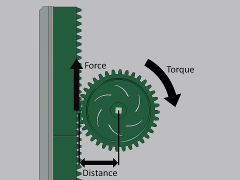

Linear Chain Lifts work similarly to a slide elevator, but they do not require parts from the linear motion kit.  Instead, chains and sprockets are utilized to raise and lower the elevator:

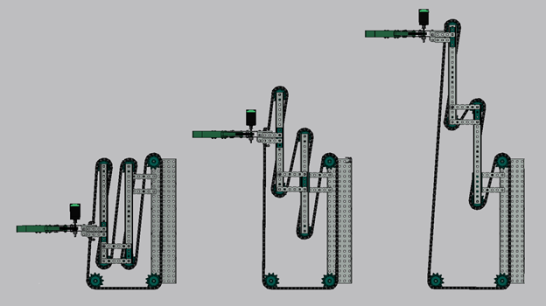

**Scissor Lift**

The last type of lift is the scissor lift. They allow the robot to reach high places by a series of two c-channels attached together at the center called stages. These stages are attached at each end of each c-channel and stacked upon each another. Because of these stages, scissor lifts generally have the highest reach out of all the lifts. Typically, the end of one piece of metal is fixed to a pivot point on the chassis and the end of the other piece of metal can slide towards the first end across the chassis. This closes the scissor, raising the two pieces.

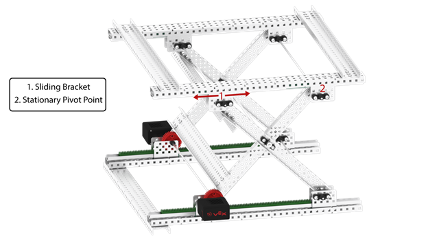
