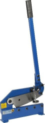

# Materials and Manipulation
Firstly, a robot doesn’t appear out of thin air. They must be built, and sometimes parts just don’t fit right. This is where manipulation comes in: Manipulation is the skillful use or exploitation of an object’s properties in favor of ones will. The usefulness of such in Vex Robotics is not limited to just building. It is also valuable for unconventional utilization of game objects. In this unit, one will learn some tricks to metalworking, as well as game possible game strategies.

## Cutting Metal

When a standard size object is too big, and the smaller size down is too small, one may consider cutting a custom size of metal. There are various ways to do such, the guide below will help you decide what is best. 
::: warning
 Tools are not toys, always use PPE such as safety glasses during use! 
:::
**Hacksaw**

The hacksaw is the ideal tool for cutting metal, easily available, precise. Its narrow thing blade is ideal for making complex cuts, however tight turns may only be achieved with relief cuts. When using a hacksaw, note that the blade should be at a 45* angle to the surface being cut.

This tool is generally set up so that the saw’s teeth will cut on the forward stroke, (away from the user). However, note hacksaw blades are reversible, so note the orientation prior to use. It is also useful to note that the hacksaw may also be used to cut various other materials such as plastic and wood, but due to the small, dense nature of the blade, it will cut very slowly. Use the hacksaw when cutting C-channels and L-shaped metals. If this tool is used on a flat sheet of metal, it will most likely catch the metal, and warp/bend it.

**Shearing Metal**

When cutting flat sheets of metal, one may use a metal shear. This tool is designed to slice through metal with an angled blade. Its operation may be compared to a paper cutter or scissors. It comes in two different variants: The hand shear is operated by hand moving a large lever and will allow for making curved cuts. The foot shear can quickly cut long sheets of metal, and will always be straight.

(Hand Shear)       (Foot Shear)

The tool is very strong and very sharp. Keep fingers away from the cutting blade at all times. The downside to such a device is its inability to cut C-channels and L-shaped pieces as they will get crushed instead of cut. Furthermore, inserting too long a sheet of metal into the hand shear will cause warping and bending, to do such, relief cuts will be needed.

**Relief Cuts**

To avoid damage to long pieces of metal, or making complicated cuts, relief cuts are used. By making a series of smaller cuts perpendicular (90*) to the intended cut, more movement room is provided for cutting tools as metal is discarded during the cutting process.

**Finishing**

Completed metal is often sharp and jagged. This will not pass tech inspection for competitions and may lead to injuries. One may fix this by filing the surface. A file is designed to cut on the forwards=d stroke similar to the hacksaw. There are two types of corners: With a filet, the entire corner is rounded smoothly, allowing for a nice, curved contour. When using a chamfer, an edge is preserved. This is particularly useful when a sharp edge is too obscured for a file to reach.

**Filet Chamfer**
 

Alternatively, one may use sandpaper to round off corners, but be careful as the sharp edge may pierce the sandpaper. However, one may also use the sandpaper to make a brushed finish on a metal surface.

## Bending metal

**C-channels**

Bending C-channels can be quite difficult. As a result, the following technique may be useful for making such parts. To do this, one must make a cut in the C-channel where the bend will take place. The illustration below highlights the calculations required for custom cuts. *Do not cut all the way through*

 

**Sheet metal – Hammers, Mallets, and vices**

Bending a thin flat sheet of metal used by Vex Robotics is very simple. One may get a corner/angled surface and work away with a mallet as using a metal hammer may flatten or dent the part being fabricated.

**Using a bending machine**

A bending machine focuses its energy and movement on a fulcrum. When a sheet of metal is placed withing the bending point, the sheet of metal will be bent as the machine moves. This allows for accurate bending to precise angles.

 

These machines come in various shapes and sized, precaution must be taken when operating a bending machine. The folding point can pinch and lead to injury.

**Using an anvil**

For those whom are interested in “Forged in Fire” The natural form of manipulating metal may be the good old anvil. This is a hardworking surface used to flatten, bend, and curl metal. One may use either a hammer or mallet, however a mallet is recommended for the soft Vex Robotics parts.

An anvil has various surfaces for different tasks, the central flat portion is used for bending at 90* angles, and hammering. The rounded “Horn” is also used for making more complex angles as well as curves. When using an anvil, be aware that the clinking noise created by hammer impact will be quite loud, hence hearing protection is recommended.

## Unbending Metal

Typically, when metal is bent, it is very difficult to restore its position prior to bending. The instructions below will allow for metal correction to various degrees of effectiveness and time taken.

**Using a clamp/vice**

By inserting metal into a clamp or vice, one may easily get grip and leverage on their working material. Simple pull in the opposite direction of the item’s bend. However, for the quickest and least precise method, press the corner of the bend within the jaws of a vice, and tighten. This will force the metal to unbend and stretch outwards and unbend itself.

**Stripped screws**

One of the most annoying part of screws is sheering the head of which the screw fits into. To work around such, simply follow the procedure below. One will need a vice, hacksaw, and flathead screwdriver.

**Converting to a flathead screw**

Firstly, lock the screw/part where the sheered screw is located into a vice securely, then take the hacksaw and cut straight along the top of the screw’s head. This will make a straight cut for the flathead screwdriver to be inserted. As a result, the hex/star screw will be converted into a flathead screw for removal. For more information to the diagram below. *Do not cut all the way through*

