# Mechanical Power Transmission
Power transmission is defined as the transfer of energy from its place of generation to a location where it is used to do work. One of the most common form of this application in VEX Robotics is taking power from a motor and applying it to a wheel to spin it. Mechanical power can be transmitted from one place to another in a variety of ways by different mediums. Let’s explore some of these mediums.

**Shafts**

Shafts transfer motion from point to point along their axis of motion.  A common example of this is the drive axle of a car. Power can be transferred into shafts via keys, splines, or polygonal shafts.

VEX uses a square shaft as part of its motion system. This means that the shaft will transfer torque directly to anything which has a matching square hole. 

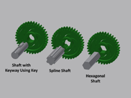(Some different types of shafts)

## Gears
**Spur Gears**

The most common type of gear is called a spur gear.  When most people think of gears, they think of spur gears.

Spur gears transfer motion between two shafts running parallel to each other. Spur Gears are characterized by their teeth, which are straight and parallel to the gear’s axis of rotation. These are the primary form of mechanical power transfer used in VEX Robotics. In addition, spur gears are found in the real world in everything from automobiles to the mechanism that opens the tray on a DVD player.

(A spur gear)

**Bevel Gears**

Bevel gears are conically shaped and transmit power between shafts that have intersecting axes of motion. These gears can transmit power between shafts at a variety of angles but are most commonly used to transmit power 90-degrees.

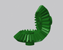(A set of bevel gears)

Crown gears are a type of bevel gear in which the teeth project perpendicular to the gear face. These gears can mesh with other bevel gears and spur gears so that motion is transferred between shafts with intersecting axes of rotation.

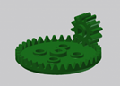(A crown gear mated with a spur gear)

**Worm Gears**

Worm gears come in pairs: worm gears and worm wheels that mate together to transfer power between perpendicular shafts that have axes of rotation offset from each other.

Worm gears resemble screws; as they spin, they turn their mating worm wheel. This type of gear pair is very useful for creating a high mechanical advantage in a small form factor. In this type of gear pair, the worm gear can drive the worm wheel forward, but it is very difficult for the worm wheel to drive the worm gear. For this reason, these gears are useful for applications where the designer doesn’t want a mechanism to be back driven.

(A worm gear mated with a spur gear)

**Pinion and Rack Gears**

A rack gear is a gear mounted to a straight rod, such that it moves in a linear fashion when torque is applied to it by a spur gear (known as the pinion gear).

Rack and pinion gear sets are commonly used to convert rotational motion to linear motion.  Cars utilize this type of gear set to convert the rotary motion of a steering wheel into a linear left/right motion required to steer the car. This is why it is called rack and pinion steering.

Within competition robotics there are many applications where rack gears can be used to create linear actuators for driving mechanisms.

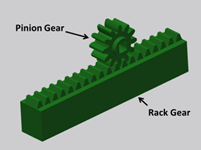(A pinion and rack combination)

**Helical Gears**

Helical gears resemble spur gears, only their teeth are curved in the shape of a helix.  These gears can be used to transmit power between two parallel axes of motion, or between perpendicular non-intersecting axes of motion.

(Helical gears are versatile)

**Epicyclic (Planetary) Gears**

An epicyclic or planetary gear set consists of one or more planet gears moving along an outer ring gear as a central sun gear drives them.  As the planet gears are driven, they typically move a planet carrier plate along with them.

Interestingly, planetary gears can be used in a variety of ways with different gears serving as the inputs and outputs.  For example, one might use the sun gear as the input and the planet carrier as the output while the ring gear is held stationary, or one might use the ring gear as the input and the sun gear as the output while the planet carrier is held stationary.  The overall mechanical advantage of a planetary gear set changes depending on the configuration used.

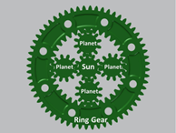(An epicyclic setup)

## Gear Ratios

**What is Mechanical Advantage?**

Gears are not just used to transfer power; they also provide an opportunity to adjust the mechanical advantage of a mechanism.

There are cases where a motor itself is powerful enough for an application, but the motor’s output characteristics are not well suited to the application. For example, a motor that is very fast, but has only a little bit of torque would not be suitable to lift a heavy load. In these cases, it is necessary to use gear ratios to change the outputs to a more appropriate balance of torque and speed.

As the mechanical advantage changes, the speed of motion also changes. Power is the rate at which work is done, so if the amount of work increases, the speed at which it gets done decreases.

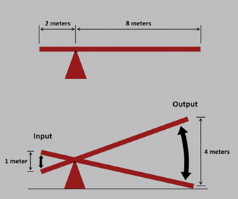(Figure 1: Lever ratio example)

In figure 1, we can see that if the input side of the lever moves 1 meter then the output moves 4 meters.  This difference is proportional to the ratio between the lengths of the levers, 4.

Let’s say that it takes one second to move the input one meter, it is moving at 1 m/s. However, the output is moving 4 m/s.

The output is moving FASTER than the input by 4 times, which is exactly the ratio of the level lengths.

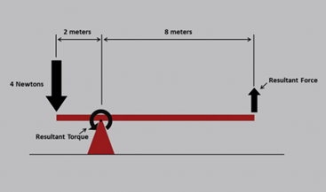(Figure 2: Lever example with applied forces)

In figure 2, the same system shown previously now has a 4 N force applied to the input. The length of its level arm is 2 m, so the resulting torque at the input is 8 Nm.

However, since the resultant force is on a level arm of 8 meters long, it will only have 1 N of force!

Looking at the above two examples, if the lever system has an input force of 4 Newtons and moves 1 meter, the output will have a force of 1 Newton and moves 4 meters – the output moves faster than the input, but with less force!

We can see how mechanical advantage (in the form of levers) can be used harness a fixed input force to accomplish a desired output. Gears work in the same manner.

**Mechanical Advantage via Gears**

A gear is basically a series of levers; the larger diameter the gear, the longer the levers

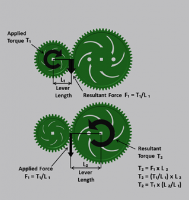

(Figure 3: Gears are really just lots of levers fashioned in a circle)

As seen in figure 3, torque applied to the first gear results in a linear force at the tip of the gear teeth. That same force is applied onto the tip of the tooth of the gear it is mated with, which in turn results in a torque rotating this gear.

Thus, we can apply the same logic from the example with levers and deduce that small gears driving large gears result in a torque increase.  Large gears driving small gears result in a torque decrease.

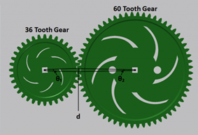(Figure 4: Speed can be altered with different-sized gears)

In figure 4, if the input 36-tooth gear is rotated 1 tooth, then the gear is rotating 1/36th of a revolution. As it advances it moves the 60-tooth gear 1 tooth also.  However, on the 60-tooth gear this is only 1/60th of a revolution.

As the small gear turns a certain amount, the larger gear turns a smaller amount. This means the larger gear is spinning slower than the small gear.

Thus we can also deduce that small gears driving big gears result in a speed decrease.  Large gears driving small gears result in a speed increase.

**Gear Ratios and Gear Reduction**

As we can see, the ratio between the sizes of two gears meshing is proportional to the resulting torque change and speed change between them. This ratio is known as gear reduction.

Since the teeth count a gear has is proportional to its diameter (if the pitch is the same), instead of using diameters to calculate gear reduction, one can just use teeth counts.

Looking back at figure 4, we can see that the set of gears have a gear ratio of 36:60 and a gear reduction of 60/36 = 1.67

## Motion Reversal & Idler Gears

One other aspect of gears designers must consider is how they reverse motion: the driven gear spins in the opposite direction as the driving gear. (Figure 5)

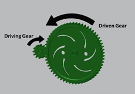(Figure 5: Two mated gears will spin in opposite directions)

To make the output gear spin in the same direction as the input gear, some designers will use something called an idler gear. (Figure 6)

Idler gears do not change the gear ratio or reduction of the system. In figure 6, the system has a ratio of 12:60 and a reduction of 60/12 = 5.

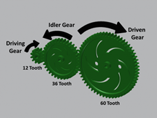(Figure 6: Just add an idler gear in between to make the output spin in the same direction as the input)

(Figure 6: Just add an idler gear in between to make the output spin in the same direction as the input)

## Compound Gear Reduction

Sometimes, a design may require more mechanical advantage than a single gear ratio can provide or is otherwise impractical. For example, if a VEX robot requires a 12:500 gear ratio it is a problem because there is no 500-tooth gear available.

In this situation, a designer can use multiple gear reductions in the same mechanism. This is called a compound gear reduction. (See below)

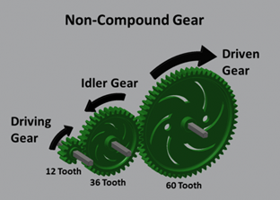

(Figure 7: Adding more gears in a linear fashion does nothing to the mechanical advantage of the system)

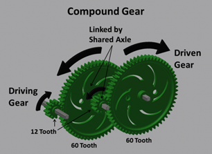

(Figure 8: Adding gears in a compound fashion does alter the mechanical advantage of the system)

In a compound gear system, there are multiple gear pairs. Each pair has its own gear ratio, and a shared axle connects the pairs to each other. The resulting compound gear system still has a driving gear and a driven gear, and still has a gear reduction (now called a “compound gear reduction”). The compound gear ratio is calculated by multiplying the gear reductions of each of the individual gear pairs.

In figure 8, the total compound gear reduction is calculates as 60/12 * 60/12 = 5*5 = 25. This is much more torque than the gearing setup in figure 7, which we calculated earlier to only have a reduction of 5!!

**Fun fact**

Shown below is a gearbox with twelve 12:60 reductions as part of one giant compound reduction. This produces an overall reduction of 244,140,625 to 1.

This means someone would need to spin the input 244,140,625 times just to get the output to spin once!

Spinning the input once per second, it would take approximately 7 years and 9 months before the output spun once!!

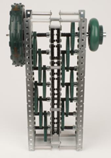

## Other types of Reduction

Gears aren’t the only mechanisms in competition robotics that provide gear reduction. The same principles apply to sprockets & chains and pulleys & belts. Similar to gears, sprocket ratios can be calculated by teeth count. (Shown below)

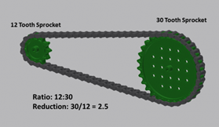

Pulleys and belts don’t have teeth, but their ratio can be calculated by comparing their diameters. (Shown below)

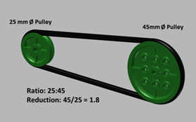

Both of these mechanisms provide more options to designers working with mechanical power transmission. These two options work great in situations where torque needs to be transferred over long distances. Unlike gears, these systems do not reverse the direction of motion.

::: details
Parts of this learning guide may be excerpted from the VEX EDR Curriculum. This learning guide is meant to be used solely for educational purposes.
:::