# Speed, Power, Torque, and DC Motors
**Dynamics**
Classical Mechanics, the study of objects in motion, is very important in robot design. The following are a few of the important concepts. Keep in mind that all of the following are vector quantities, meaning they have direction, as opposed to scalar quantities, which do not. In one-dimensional contexts, the direction is usually represented with +/-.

| Name        | Definitions | Common Units|
| ----------- | ----------- | ----------- |
| Velocity (v)     | A measure of the change in position per unit time.    |  metres/second (m/s), kilometres/hour (km/h)   |
| Angular Velocity (ω)  | A measure of the change in angular-position per unit time. Another way to think about it is how much portion of a circle is covered by an object per unit time. This is the rotational counterpart to velocity.      | degrees/second (°/s), radians/second (rad/s), revolutions/minute (rpm)       |
| Acceleration (a) | A measure of the change in velocity per unit time. An object with constant velocity has 0 acceleration.      | metres/second2 (m/s2), kilometres/hour2 (km/h2)      |
| Angular Acceleration (α)| A measure of the change in angular velocity per unit time. An object with constant angular velocity has 0 acceleration.     | degrees/second2 (°/s2), radians/second2 (rad/s2)     |
| Force (F)  | A push or pull. Unbalanced forces cause acceleration. A ball you push accelerates from rest because you exert a force on it while it does not have an equal and opposite force to balance it. Force is related to acceleration by Newton’s second law: a=F/m, where m is mass.      | Newtons, Pounds       |
| Torque (τ)  | A measure of a force that can cause an object to rotate. If torque is spinning an object, the object will create a linear force at its edge. Torque is calculated by multiplying the linear force by the distance from the centre of the circle. Torque causes angular acceleration just like linear force causes linear acceleration. The relation between torque and angular acceleration involves explaining moment of inertia, which is outside the scope of this lesson.     | Newton-Meters, Inch-Pounds        |

An example for these concepts: A motor applies force on a wheel on the ground in the anticlockwise direction by rotating the axle. So there is a torque on the wheel, which causes a force to be exerted at the edge of the wheel to the right on the ground. By Newton’s third law, the ground exerts equal force on the wheel. This force causes the wheel to accelerate, both linear and angular, which causes a change in the velocity and angular velocity to the left.

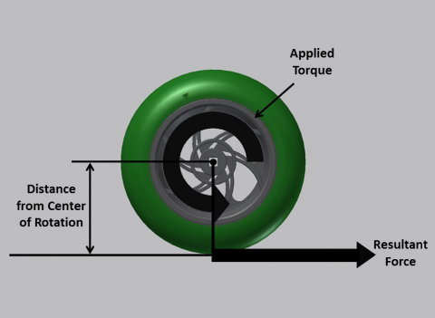(Fig 1: Wheel Torque)

Given the torque applied on the axle with the wheel on it and the wheel radius, the force exerted by the wheel on the ground is given by the equation:

Force = Torque / Wheel Radius

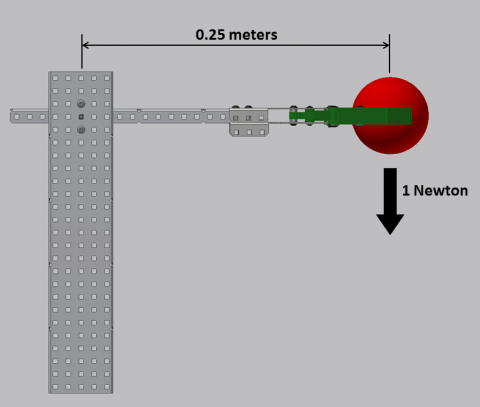(Fig 2: Arm – Weight)

In Fig 2, a robot arm is holding a ball. Since the force of the gravity on the object is 1 Newton and the ball is 0.25 meters from the centre of rotation, the torque required to lift the ball can be calculated as the following:

Torque = Force x Distance = 1 Newton x 0.25 Meter = 0.25 Newton-Meters.

So, the torque required to hold the object without falling is 0.25 Newton-Meters in the counterclockwise direction; lifting it would require more. The more torque the motor has, the more force is exerted on the ball, causing more acceleration, meaning the arm will go up faster.

Important relations:
Remember that Torque is inversely related to distance from the centre and directly proportional to the force. This means that doubling the length of the arm in the example above would also double the torque required to lift. So, making the arm shorter would require less torque but also not be able to lift as high. In addition, doubling the weight of the object the arm is carrying would also double the torque required. Keep these trade-offs in mind when designing robots.

## Work and Power
| Name        | Definitions | Common Units|
| ----------- | ----------- | ----------- |
| Work (W)     | A measure of force exerted over distance. Work transfers energy between forms and/or objects. Work done by a force on an object is calculated by multiplying the force by the distance it travels.    | Joules   |
| Power (P)    | A measure of the rate at which work is done. Power can be calculated directly by multiplying the velocity of an object by the amount of force exerted on it. In robotics, power is usually used as a limit since there is a power limit of robotics systems.   |  Watts, Horsepower |

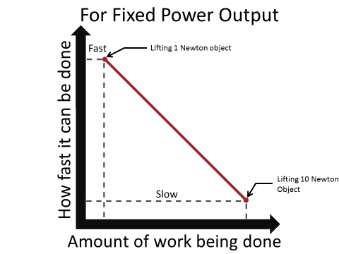

(Fig 3: How quickly work can be completed vs amount of work with constant power)
As shown in Fig 3, for a constant power output, a trade-off has to be made between the amount of work done and the time it takes to do the work.
This is very relevant for designing robots for competition design as there are power limitations imposed and each motor has a power limit.

## DC Motors

In a competition robot, everything is driven by actuators, which are mechanisms that are used to act upon an environment, usually for moving or controlling a mechanism or system. Motors are the most common type of actuator in a VEX robot, which uses Direct Current (DC) Motors.

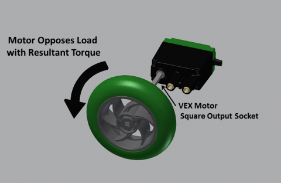(Fig 4: Motor output)

A motor is a device that converts electrical energy to mechanical energy through the use of electromagnetism. The details of the process of conversion is not relevant for building robots but the interested reader can learn about it here. A motor outputs a fixed amount of mechanical power when a voltage is applied to it.

**Motor Loading**

Motors only apply torque in response to loading. Ideally, with no loading on the output the motor will spin very, very fast with no torque. This never happens in real life, since there is always friction in the motor system acting as a load and requiring the motor to output torque to overcome it. The higher the load placed on the motor is, the higher the motor will “fight back” with an opposing torque. Since the motor outputs a fixed amount of power, the higher the torque that it outputs, the lower the angular velocity will be. So the motor spins slower when more work is required of it. If the load is high enough that the motor cannot overcome it, it stops spinning. This is known as a stall.

(Fig 5: Speed vs Load Torque)

**Current Draw**

The amount of current (common unit: amp) a motor draws is proportional to the torque it outputs which is proportional to the load. So, the current and rotational speed are inversely related.

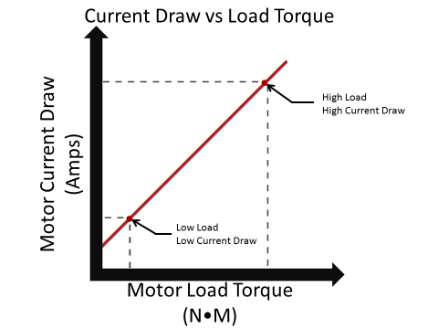

(Fig 6: Current Draw vs Load Torque)

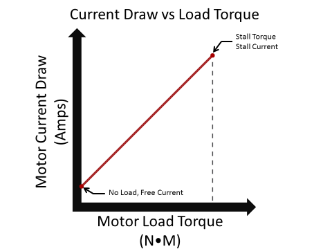

(Fig 7: Current Draw vs Load Torque showing no load and stall torque)

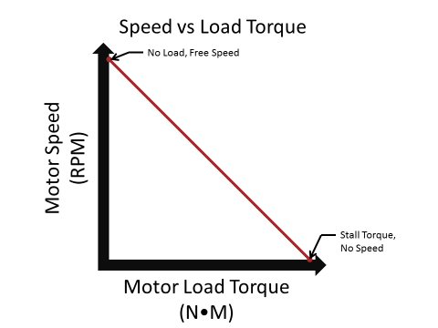

(Fig 8: Speed vs Load Torque showing no load and stall torque)

Based on the above relationships, one can see how the concept of power comes into play. With a given load, the motor can only spin at a certain speed.
There are 4 key properties of a motor that make it different from other motors:

<ol>
<li>Stall Torque (N-m): The amount of load placed on a motor that will cause it to stop moving.</li>
<li>Free Speed (RPM): The maximum rotational speed a motor will run at when it is under no load.</li>
<li>Stall Current (Amp): The amount of current a motor will draw when it is stalled.</li>
<li>Free Current (Amp): The amount of current a motor will draw when it is under no load.</li>
</ol>

**Varying Power with Voltage**

The more voltage is applied to the motor, the more power it can output and the faster it can do work. This implies that to spin a given load faster, one must apply more voltage to the motor to increase the power it can output. It is important to note that all of the characteristics of a motor listed above, except free current (which does not change), are directly related to voltage, which is why they must be listed with a certain voltage. This means that one can calculate those properties using ratios.
The voltage applied on the motors in a VEX robot are regulated by motor controllers, so that robot designers can vary the power output of motors under load. In the older Cortex system, separate 3-wire motor controllers were required. In V5, motor controllers are built into the V5 Smart Motors.

(Fig 9: Speed vs Load Torque)

**Motor Limits and Calculations**

Robot designers cannot keep adding more voltage to a motor to be able to output the power they want. This is because motors have power limits, as aforementioned, and pushing them over the limit can cause them to fail. Fortunately, VEX motors have thermal breakers built that will cut the current if the motor gets too hot. This ensures that the motors won’t burn out. So, the robot designers must make sure that the amount of load is not enough to draw more current than a specified amount, which would cause the breaker to trip.

**Arm Load Calculation**

The concepts and equations learned so far can be used to figure out the maximum load for an arm attached to a motor. Here are some examples:

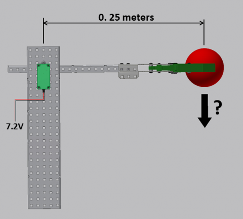

(Fig 10 Example)

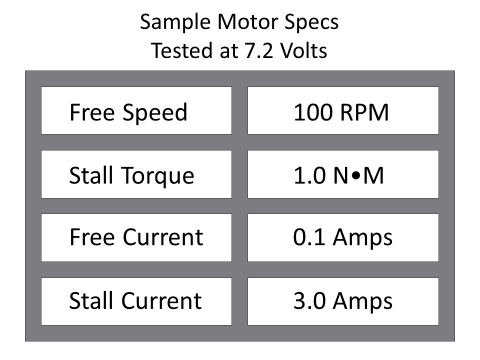

(Fig 11: Sample Motor Specs)

In the example shown in Fig 10 and Fig 11, to calculate the maximum weight the arm can hold stationary, the designer must first calculate the maximum torque the motor can output without tripping the breaker.

Weight Load calculated from Torque:

The maximum weight the robot can hold stationary occurs at the stall torque of the motor.  If the motor is stalled, it is applying a torque of 1 N-m on the robot arm, which is 0.25 meters long.  Torque = Force * Distance

Force = Torque / Distance = 1 Newton-meter / 0.25 meters = 4 Newtons

The arm can hold up 4 Newtons at the motor stall. Any more and the arm will drop down.

Torque Load Calculated from Current Limit:

If the current limiting breaker is set to trip when the current exceeds 2 amps, for instance, the motor would not run at stall because the stall current is 3 amps. So the maximum torque load with current at 2 amps must be determined.

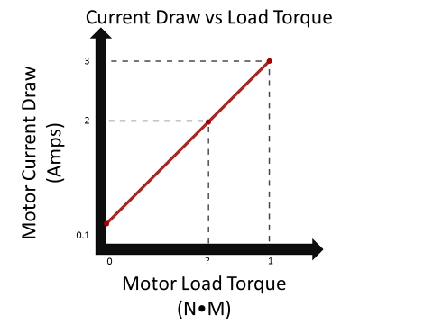

(Fig 12: Current Draw vs Load Torque)

Since the relationship between motor load torque and motor current draw is linear, the slope of the graph in Fig 12 can be expressed as

m = (Change in Y / Change in X) = (Stall Current – Free Current) / Stall Torque

The y-intercept, b, is the free current. So the linear relation can be expressed as

Current = ((Stall Current – Free Current) / Stall Torque) x Torque Load + Free Current

Plugging in the known values (with 2 amps as current) and solving the equation results in the torque load being 0.655 N-m. Then the weight force can be calculated as
Force = Torque / Distance = 0.655 N-m / 0.25 m = 2.62 N

If the robot arm picks up an object heavier than 2.62 N, it will trip the motor circuit breaker.

**Motor Speed from Torque Load Calculations**

Using the same example as before, here is how to determine the speed of the motor at a given torque, which in this case is 0.655 N-m.

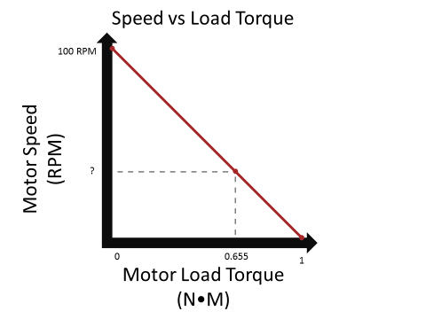

(Fig 13: Speed vs Load Torque)

The relation between speed and load torque can be derived in a way similar to the previous example, which would result in the relation:

Speed = -(Free Speed / Stall Torque) x Torque Load + Free Speed

After plugging the known values, the speed can be calculated to be 34.5 RPM.

The motor will spin at 34.5 RPM when it is under a torque load of 0.655 N-m, while drawing 2 amps and lifting an object weighing 2.62 N.

**Multiple Motors**

Some applications require more power than the motor can handle. In those cases, the robot designer has 3 options to solve the problem:

Engineer the robot to lower the power requirement so that the motor’s maximum power would work.
Replace the motor with one that can handle more power.
Use multiple motors for that application.
When multiple motors are used, the torque load is balanced among all the motors. For example, if 2 motors are used for a 2 N-m torque load, each motor will have a torque load of 1 N-m.
A simple way to think about it is that the motors take on the characteristics of one super-motor with combined specs of the individual motors.  The stall torques, stall currents, and free currents add together but the free speed doesn’t change, as shown by Fig 14.

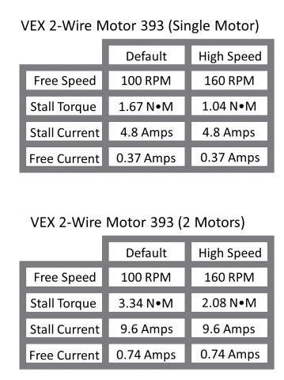

(Fig 14: VEX Motor 393 specs)

## Formulas

Speed = Distance / Time
Rotational Speed = Rotational Cycles / Time
Rotational Speed = Degrees / Time
Torque = Force x Distance
Force = Torque / Distance    Where the Distance is the distance from the axis of rotation
Power = Force x Velocity

Motor Key Specs:

1. Stall Torque
1. Free Speed
1. Stall Current
1. Free Current

**For determining motor characteristics as voltage varies:**

New Value = Spec Value x (New Voltage / Spec Voltage)

**For determining Motor Current Draw at a given Torque Load:**

Current Draw = ((Stall Current – Free Current) / Stall Torque) x Given Torque Load + Free Current

**For determining the Torque Load at a given Motor Current Draw:**

Torque Load = (Given Motor Current – Free Current) x Stall Torque / (Stall Current – Free Current)

**For determining Motor Rotational Speed at a given Torque Load:**

Rotational Speed = -(Free Speed / Stall Torque) x Given Torque Load + Free Speed

**For determining “Super” Motor Specs from Multiple Motors combined as one, geared to the same Speed:**

Free Speed = SAME

Stall Torque = Sum of all Motor Stall Torques

Stall Current = Sum of all Motor Stall Currents

Free Current = Sum of all Motor Free Currents