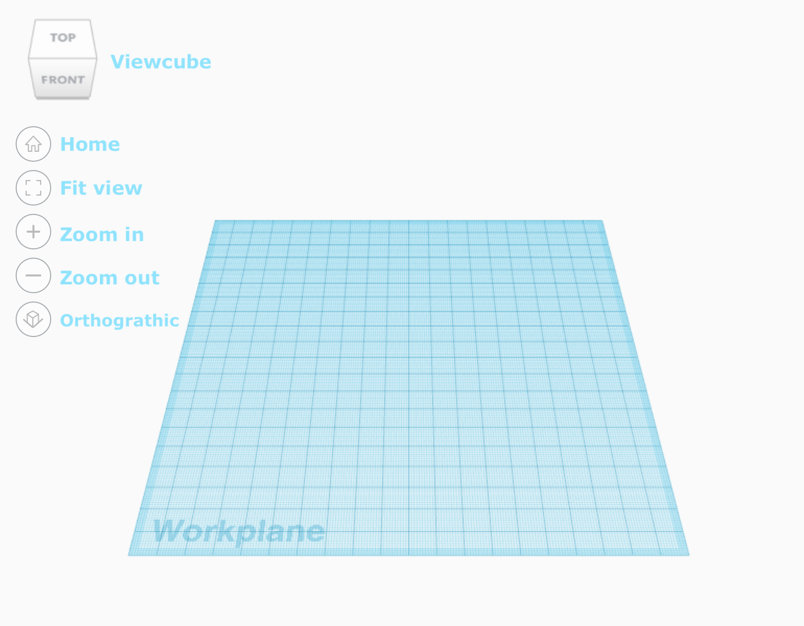
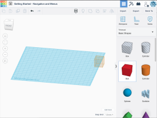
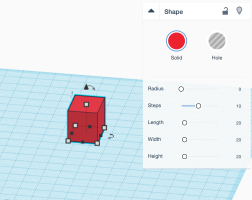
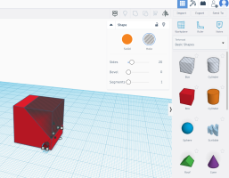
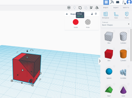
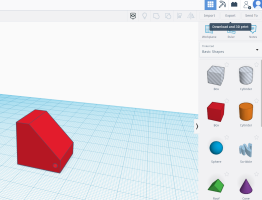
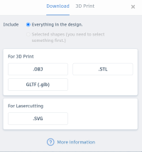

# Tinkercad Tutorial

Autodesk Tinkercad is an easy-to-use yet powerful tool for creating 3D designs. In this lesson, we will guide you around the Tinkercad site to prepare you for creating your model.
## Basics
 

Above: Tinkercad Workspace: https://www.tinkercad.com/

**Items shown in image above:**
* Workplane - surface where you place shapes and create your design
* Viewcube - tool to help tilt and rotate your camera to change your perspective
    * Click and drag the viewcube to turn the camera angle
    * Hover over the viewcube and select one of the four surrounding arrows to switch directly to that view
* Home - move camera back to original position
* Fit view - automatically fixes zoom so all objects on workplane can be seen
* Zoom in - zoom in on object
* Zoom out- zoom out on object
* Orthographic - shows orthographic view
**Additional notes**
* You can use the scroll wheel on a mouse to zoom 
* Or use the gesture normally used for zooming on a touchpad
* Try right clicking and dragging the mouse. The camera will tilt and rotate!

## Creating Shapes
 
* Select a shape from the right hand toolbar, click and drag the shape to your workspace
* After placing the shape, select it and the shape window will appear. Here you can change the color and dimensions of your object
* Try changing the dimensions by dragging on the corners 
* You can also rotate the object by clicking and dragging the rounded arrows at the base
* You can still move the shape after placing by clicking and dragging the object around your workspace. As you drag, you will see options to set the exact location of the shape
* Note that there is an option to have a solid or a hole. This is used for cutting shapes.
## Cutting Shapes
 
* To cut shapes, place a shape and select hole. The grey shape indicates the parts that will be cut out of the model.
* To confirm the cut, simply group the parts together by selecting all parts and clicking the group option as shown in the  image on the right.
  * To Ungroup parts, simply click the Ungroup icon to the right of the Group icon.
  ## Saving to .STL for printing
 
* In the top right hand corner, you will find the export button, clicking this will open a downloading menu.
* Simply click .STL, and your computer will automatically download the file
* pload the .STL file to SRIL with the following link for 3D printing: (INSERT LINK HERE)

**The deadline to submit your CAD design  is August 14th 2021**
